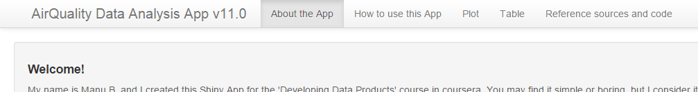
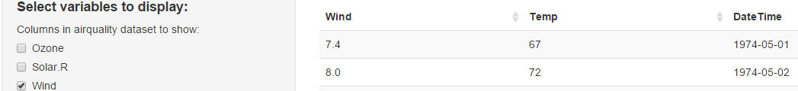
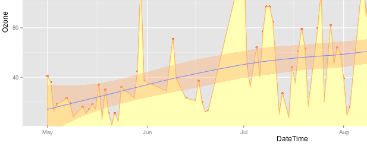

  
## About this App
  
  This App was created for Johns Hopkins 'Developing Data Products' Course (teached by Brian Caffo) on coursera.org and its purpose is only academic.

With this App you'll be able to:

1. Study and analyse rapid and easily the 'airquality' R dataset values and variables.
2. Sort, extract and play around with its values and variables displayed on a datatable.
3. Create X vs Y plots and customize the variables shown, the elements plotted, their colors, add fit lines and areas and know some information about the data.

You can access the App clicking on <a href="https://manuelblancovalentin.shinyapps.io/AirQuality-Data-Analysis-App-v11/">here</a>.

Or visit its GitHub Repo clicking on <a href="https://github.com/manuelblancovalentin/DevelopingDataProducts-Project/">here</a>.


--- .class #id 

## The Airquality dataset

The airquality dataset comes with the dataset package and provides a total of 153 measurements of Ozone and Solar Radiation levels, wind velocity (in mph), and Temperature (in Fahrenheit), taken from 1st May 1974 to 30th Sep of the same year at La Guardia Airport, NYC.

See the first rows below:

```
##   Ozone Solar.R Wind Temp Month Day
## 1    41     190  7.4   67     5   1
## 2    36     118  8.0   72     5   2
## 3    12     149 12.6   74     5   3
```

Month and day columns have been merged to one. The final data table looks like below: 

```
##   Ozone Solar.R Wind Temp   DateTime
## 1    41     190  7.4   67 1974-05-01
## 2    36     118  8.0   72 1974-05-02
## 3    12     149 12.6   74 1974-05-03
```

--- 

## Navigating the App

Once you enter the App you'll see a navigation Bar just like the one on the image below: 



To move around the App just click on any of those tabs:

<ul>
<li><b>1. About the app:</b> On this tab you can find some information about the App, the data used, etc.</li>

<li><b>2. How to use this App:</b> Here you will find a few instructions that might help you getting used to the App and all its functions. </li>

<li><b>3. Plot:</b> On this tab you will be able to Plot the airquality data. </li>

<li><b>4. Table:</b> On this tab you will be able to see the airquality data on a table. </li>

<li><b>5. Reference sources and code:</b> All references sources, links and code links itself are shown at this tab (if anyone is interested on). </li>
</ul>

--- 

## Plot and Table

Use the table to visualize your data, play around with the variables, sort them or search for any values on them. Download the table to a txt, csv or xls file.


Or create X vs Y plots of any variables you want, add fit lines, change its color, get information about maximum, minimum, average values and Zoom on X and Y axis values.
 
