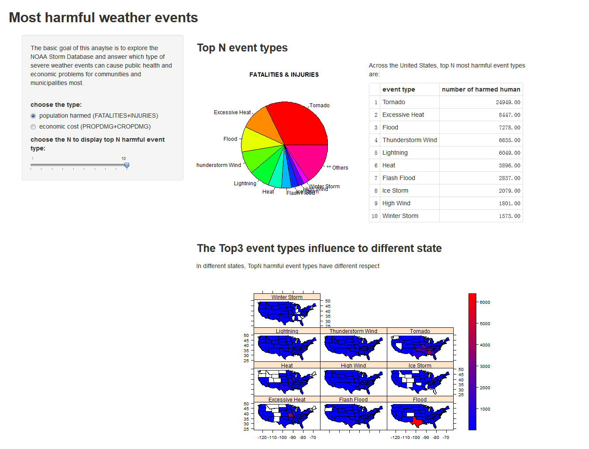
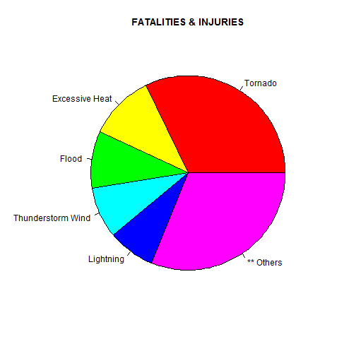
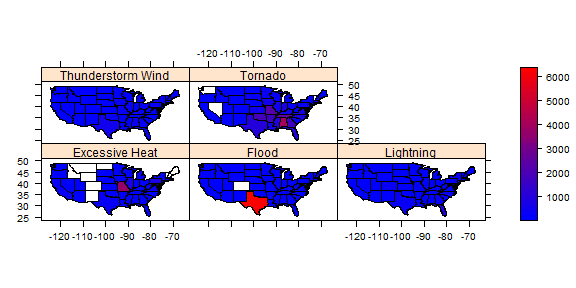

Weather event types most harmful to public health and economic
========================================================
author: gdwangh
date: Thu Dec 18 13:34:08 2014
transition: rotate

Introduction
========================================================

- **goal**

    The severe weather events to cause public health and economic problems cross US
    
  + public health : FATALITIES + INJURIES 
  + economic : PROPDMG + CROPDMG 
  
- **data**: the NOAA Storm Database   

  <small> http://d396qusza40orc.cloudfront.net/repdata%2Fdata%2FStormData.csv.bz2 </small>
    
- clean the data as the document:   

  <small> http://rpubs.com/gdwangh/rr_ass2 </small>

The website
========================================================
left: 80%

https://gdwangh.shinyapps.io/weatherEventHarm/

***
   
### choose
- event type
  * population
  * cost
- top n

code for the top n (e.g. n=5)
========================================================


```r
popu_sum<-popu[,sum(harm_popu),by=valid_type]
setnames(popu_sum, "V1", "sum")
sorted_popu_sum<<-popu_sum[order(popu_sum$sum, decreasing=TRUE)]
n=5; topN<-sorted_popu_sum[1:n,]; topN
```

```
          valid_type   sum
1:           Tornado 24949
2:    Excessive Heat  8447
3:             Flood  7278
4: Thunderstorm Wind  6635
5:         Lightning  6049
```
***

```r
other<-data.table(valid_type="** Others",sum=sum(sorted_popu_sum[(n+1):nrow(sorted_popu_sum),]$sum))
data<-rbind(topN, other)
pie(data$sum, labels=data$valid_type, col=rainbow(length(data$valid_type)),
    main="FATALITIES & INJURIES")
```

 

Code for mapplot
========================================================


```r
library(choroplethrMaps); library(maps); library(latticeExtra)
data(state.regions)

pmelt<-melt(subset(popu, valid_type %in% sorted_popu_sum[1:n,]$valid_type), id.vars=c("valid_type", "STATE"),measure.vars=c("harm_popu"))
popu_state_sum<-dcast(pmelt,STATE+valid_type~variable, fun=sum)  
data<-merge(popu_state_sum, subset(state.regions,!abb %in% c("HI","AK"), select=c("region","abb")), by.x="STATE",by.y="abb")
mapplot(region~harm_popu|valid_type, layout=c(3,2), data = data,xlab="", map = map("state",plot=FALSE, fill = TRUE), colramp = colorRampPalette(c("blue","red")))
```

 
